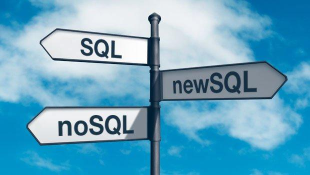
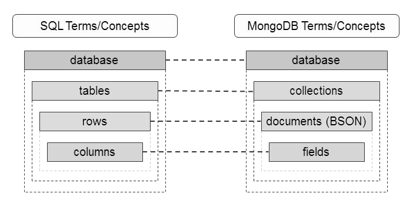

 

#  O que é SQL?

###  **SQL** é a sigla para “Structured Query Language”, que significa, traduzindo para o português, “Linguagem de Consulta Estruturada”. Trata-se de uma linguagem de consulta a banco de dados relacionais.

### Com o SQL você pode executar vários comandos para criar, alterar, gerenciar, consultar, etc no seu banco de dados.

### Costumamos dizer que bancos SQL seguem uma modelagem relacional, pois estes se baseiam no fato de que todos seus dados sejam guardados em tabelas.

#    E NoSQL? O que é?

###  NoSQL (Not Only SQL) é o termo utilizado para banco de dados não relacionais de alto desempenho onde, geralmente, o SQL não é utilizado como linguagem de consulta.

### O NoSQL foi criado para ter uma performance melhor e uma escalabilidade mais horizontal para suprir necessidades onde os bancos relacionais não são eficazes.

##  Tipos de bancos de dados NoSQL:

## - Documento

Os dados são armazenados como documentos. Os documentos podem ser descritos como dados no formato de chave-valor, como por exemplo, o padrão JSON.

Um exemplo de banco de dados neste formato é o **MongoDB**.

## - Colunas

Os dados são armazenados em linhas particulares de tabela no disco, podendo suportar várias linhas e colunas, além de permitir sub-colunas.

Um banco de dados dessa família, por exemplo, é o **Cassandra**.

## - Grafos

Os dados são armazenados na forma de grafos (vértices e arestas).

O **Neo4j** é um banco que utiliza grafos.

## - Chave-valor

Essa família de bancos NoSQL é a que aguenta a maior carga de dados, pois o conceito dela é que um determinado valor seja acessado através de uma chave identificadora única.

Um exemplo é o banco de dados **Riak**.

#    Então, SQL vs NoSQL?

### O conceito de modelo relacional (SQL) se baseia no fato de que todos os dados sejam guardados em tabelas.

### Ao modelo não-relacional (NoSQL) se aplica o conceito de schema: uma chave de valor é que é utilizada para recuperar valores, conjunto de colunas ou documentos.

##    Quais são as diferenças?

 

### O SQL tem certa dificuldade em conciliar a demanda por escalabilidade. Quanto à escalabilidade do NoSQL, devemos levar em consideração a modelagem do sistema.

### Do que adianta termos um sistema super simples e querermos utilizar o NoSQL apenas pela escalabilidade? Todo o ganho de performance seria perdido quando rodássemos a aplicação.

### Um ponto forte do SQL é quanto à consistência das informações.

### Já o NoSQL garante o último valor atualizado, isso se nenhuma atualização for realizada até o momento da consulta.

### Quanto à segurança, ambos estão suscetíveis a ataques.

#    E o NewSQL: o melhor dos dois mundos?

Os bancos de dados NewSQL buscam promover a mesma melhoria de desempenho e escalabilidade dos sistemas NoSQL, não abrindo mão dos benefícios dos bancos de dados tradicionais da linguagem SQL, nem das propriedades ACID.

Mike Stonebreaker, fundador do VoltDB (um dos bancos de dados desse novo modelo), destacou a vantagem dos bancos de dados NewSQL por proporcionarem consultas em tempo real, além de maior capacidade de processamento.

Segundo Mike, há um custo grande em não usar SQL, sendo exigido trabalho excessivo dos desenvolvedores para compensar sua ausência.

Diferente dos SGBD tradicionais, que eram considerados soluções para qualquer tipo de aplicação, os NewSQL utilizam uma estratégia diferente, onde cada novo sistema desenvolvido visa atender a uma necessidade específica do mercado.

E eles fazem isso de forma separada, terminando com o antigo conceito de ter um único sistema que sirva para qualquer tipo de aplicação, fazendo com que os bancos de dados sejam especialistas para um propósito.

Isso impede que um número absurdo de funções e comportamentos desnecessários para uma determinada aplicação sejam gerados.

_**STONEBRAKER**_ e _**CATTEL**_ (2011) definem cinco características de um **SGBD NewSQL**:

- Linguagem SQL como meio de interação entre o SGBD e a aplicação;
- Suporte para transações ACID;
- Controle de concorrência não bloqueante, para que as leituras e escritas não causem conflitos entre si;
- Arquitetura que forneça um maior desempenho por nó de processamento;
- Arquitetura escalável, com memória distribuída e com capacidade de funcionar em um aglomerado com um grande número de nós.

#    Vantagens e desvantagens: SQL, NoSQL e NewSQL

### A seguir temos um comparativo das características dos bancos de dados relacionais (RDBMS), NoSQL, e NewSQL, com suas capacidades e pontos fortes.

| Característica                                         | RDBMS  |   NoSQL   |        NewSQL        |
| ------------------------------------------------------ | :----: | :-------: | :------------------: |
| Cumprimento ACID (dados, integridade de transações)    |  Sim   |    Não    |         Sim          |
| OLAP / OLTP                                            |  Sim   |    Não    |         Sim          |
| A análise dos dados (agregados, transformar, etc.)     |  Sim   |    Não    |         Sim          |
| Rigidez do esquema (mapeamento rigoroso da modelo)     |  Sim   |    Não    |          ~           |
| Flexibilidade formato de dados                         |  Não   |    Sim    |          ~           |
| A computação distribuída                               |  Sim   |    Sim    |         Sim          |
| Escala para cima (vertical) / Dimensionar (horizontal) |  Sim   |    Sim    |         Sim          |
| Desempenho com crescimento de dados                    | Rápido |  Rápido   |     Muito Rápido     |
| Sobrecarga de desempenho                               | Enorme | Moderado  |        Mínimo        |
| Popularidade / Suporte comunidade                      | Enorme | Crescente | Crescendo lentamente |

A partir dessa tabela podemos observar que o NewSQL é um aprimoramento do RDBMS, utilizando o melhor dos dois mundos.

Ele manteve totalmente as características dos bancos de dados padrões, implementando as inovações do NoSQL.

Os itens em que foram marcados com “Talvez” dependem do Banco NewSQL que estamos utilizando.

Como vimos, cada banco tem um propósito específico. Existem alguns bancos NoSQL especialistas com o poder do NewSQL, como é o caso do _**MariaDB**_ (Desenvolvido pelo criador do MySQL).

###    Leituras Complementares:

- Leia [Banco de dados noSQL](https://blog.geekhunter.com.br/banco-de-dados-nosql-um-manual-pratico-e-didatico/) um manual pratico e didatico.

- Leia [Qual a melhor linguagem para ciencia de dados](https://blog.geekhunter.com.br/qual-a-melhor-linguagem-para-ciencia-de-dados/)?

- Quando e como [implementar Big Data](https://geekblogti.wpengine.com/quando-e-como-implementar-big-data/)?

- Leia este artigo sobre os [melhores softwares para big data](https://geekblogti.wpengine.com/big-data-quais-sao-os-melhores-softwares/)

#   
Fonte principal [GeekHunter](https://blog.geekhunter.com.br/). Este documento foi criado usando [Markdown Live Preview](https://markdownlivepreview.com/).
