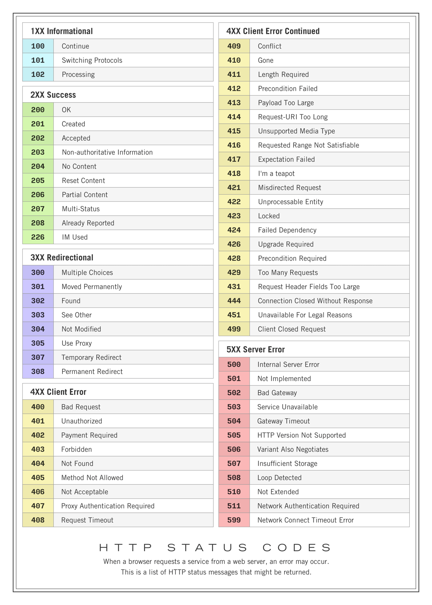

# Olá, bem-vindo ao repositório

Criando sua primeira API - Dev Week

Por que .NET e C# ?

- Multiplataforma e ótima curva de aprendizagem
- Framework Web entre os mais populares: [ASP.NET](http://ASP.NET) CORE
- Oportunidades de mercado em grandes empresas nacionais e internacionais


# O que é C# e .NET ?

- C# é uma linguagem orientada a objetos, permite criar diferentes tipos de aplicações
- Framework Web entre os mais populares: [ASP.NET](http://ASP.NET) CORE
- Criada em [julho](https://pt.wikipedia.org/wiki/Julho) de [2000](https://pt.wikipedia.org/wiki/2000) é a uma evolução de linguagem de alto nível do C e C++ para se tornar mais amigável e de fácil aprendizagem


# Requisições HTTP


## Verbos HTTP

- Get - Selecionar/Buscar Dados
- Post - Enviar dados
- Put - Atualizar dados
- Patch - Atulizar parcialmente dados
- Delete - Deletar dado


# Instalando o Entity Framework Core

[EF Core tools reference (.NET CLI) - EF Core](https://docs.microsoft.com/en-us/ef/core/cli/dotnet)


# Pacotes Nuggets

Consulte os pacotes nuget em:

[https://www.nuget.org/profiles/Microsoft](https://www.nuget.org/profiles/Microsoft)

```csharp
dotnet add package Microsoft.EntityFrameworkCore.Design
```

```csharp
dotnet add package Microsoft.EntityFrameworkCore.InMemory
```





### Replica do post [original](https://apple-cheek-322.notion.site/Criando-sua-primeira-API-Dev-Week-640468699afb45c48196099cadcf1686).

